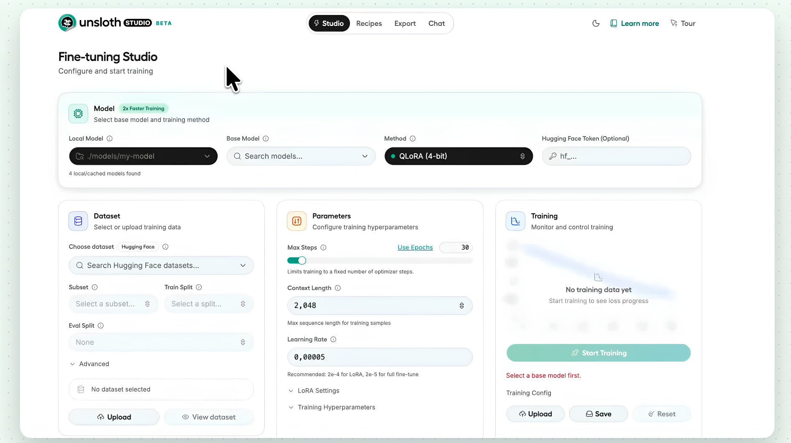

# 🦥 Unsloth studio — Local AI Without Compromises

**Unsloth studio** is an open-source, cross-platform studio application that combines a full-fledged inference engine and model fine-tuning tool on your own hardware under one roof. The application supports text LLMs, multimodal models, diffusion image and video generators, as well as audio systems.

  

---

## 🚀 Why Choose Unsloth studio?

Unsloth studio eliminates the traditional barriers of local AI: setup complexity, VRAM shortages, and fragmented tools.

* **⚡ Faster Training with Minimal VRAM Consumption (2x Faster, -70% Memory):** Powered by Unsloth's proprietary optimized CUDA/Triton kernels, you can train models (from 1B to 70B+ parameters) on consumer GPUs without losing precision.
* **🎯 No-Code Fine-Tuning & Data Recipes:** Forget about manually constructing JSONL files. Upload PDF, CSV, DOCX, or JSON files and create ready-to-use training datasets through the visual Data Recipes editor (powered by NVIDIA DataDesigner).
* **🤖 Direct Integration with Third-Party Agents (`unsloth start`):** Connect popular coding and annotation agents (Claude Code, OpenAI Codex, OpenCode, Hermes Agent, OpenClaw) to your local models with a single command.
* **🛡️ Self-Healing Tool Calls:** An intelligent auto-repair mechanism for malformed JSON/XML structures increases function calling accuracy by 30–50%, especially on smaller models.
* **🔒 Complete Privacy & Sandboxing:** All Bash and Python execution runs inside an isolated container. The app explicitly prompts for permissions before accessing local files or the network.
* **🌐 Cross-Platform & Hardware-Agnostic Architecture:** Native support for NVIDIA GPUs (including Multi-GPU), AMD (ROCm/Vulkan), Intel, Apple Silicon (via native MLX integration), and standard CPUs.
* **🎨 Full Media Studio (Image, Video, Audio):** Generation, editing, and LoRA adapter fine-tuning for diffusion models (FLUX, Wan, LTX, Z-Image), alongside Whisper and Text-to-Speech (TTS) support.
* **🌍 Flexible Server & Remote Access:** Built-in OpenAI and Anthropic-compatible API, LAN streaming, and instant global access via an encrypted Cloudflare HTTPS tunnel.

---

## 📥 Installation

Select the installer for your operating system:

### 1. Windows (`.exe`)
1. Go to the [Releases](../../releases) section and download **`Unsloth-studio-x64.7z`**.
2. Run the executable and follow the setup wizard instructions.
3. *Recommendation:* Ensure your system has up-to-date NVIDIA drivers with CUDA 12.x+ support.

### 2. macOS (`.dmg`)
1. Download **`Unsloth-studio-macOS.dmg`** (supports Apple Silicon M1/M2/M3/M4 chips and Intel processors).
2. Open the mounted `.dmg` image and drag the **Unsloth studio** icon into the **Applications** folder.
3. On Apple Silicon Macs, the app automatically utilizes the **MLX** framework to leverage Unified Memory directly.

---

## ⚙️ Detailed Feature Overview

### 1. Model Hub & Dataset Catalog

* **Discover & On-Device Views:** Search popular models from Hugging Face with full metadata cards or manage locally cached models automatically detected on your drive.
* **"Shows Model Fit" Filter:** Filters model listings based on system GPU/RAM specs so you only download runnable quants.
* **1-Click GGUF Quant Downloads:** Choose from various quantization levels (Q4_K_M, FP16, etc.) and download models or Hugging Face datasets directly in the UI.

### 2. Inference, Web Search & Run Settings

* **Autonomous Web Search:** Performs live internet queries, aggregates search results into structured comparison tables, and lists cited sources.
* **Granular Tool Approvals:** Displays explicit permission prompts before executing Python code or web searches.
* **Visual `llama.cpp` Control (Run Settings):** Configure GPU offloading layers, context windows, temperature, or add custom flags (`extra_args`) before launch or via mid-session restarts.

### 3. Projects & Interactive RAG

* **Document Knowledge Base:** Upload PDFs, DOCX, or text files into projects to serve as persistent knowledge bases for chat conversations.
* **Side-by-Side PDF Citation Viewer:** Clicking source footnotes opens the exact page of the uploaded PDF directly next to the chat window.
* **Data Synthesis & Calculations:** Extracts financial/numerical metrics across multiple years, performs calculations (e.g., percentage changes), and outputs verifiable data tables.

### 4. Media Studio (Image & Video)

* **Create (Text-to-Image):** Local image generation using models like Z-Image Turbo GGUF.
* **Transform (Image-to-Image):** Modify existing images while preserving underlying composition and structure.
* **Inpaint (Brush Replacement):** Selectively mask image areas with a brush tool to swap colors or replace specific objects while keeping the rest of the image untouched.
* **Extend (Outpainting):** Expand canvas borders in any direction to generate additional surrounding environment and detail.
* **Local Video Generation:** Dedicated video workstation tab for launching local video models.

### 5. No-Code Fine-Tuning Engine

* **Custom Dataset Training:** Fine-tune LLMs (e.g., Qwen series) via LoRA/QLoRA using local JSONL dataset files.
* **Hyperparameter Control:** Adjust epochs, learning rate, context length, LoRA Rank/Alpha, target modules, and optimizers.
* **Real-Time Telemetry:** Live dashboards tracking loss curves, learning rate, gradient norms, token throughput, GPU VRAM usage, temperature, and power consumption.
* **Export & Model Arena:** Save LoRA adapters, convert them to GGUF format, or evaluate fine-tuned vs. base models side-by-side in chat.

### 6. Tools, Audio & Local API Server

* **Audio Module:** Built-in speech-to-text (STT) via Whisper and natural voice synthesis (TTS).
* **Data Recipes:** Visual pipeline builder for preparing, transforming, and formatting raw datasets.
* **Compatible Local API:** Exposes OpenAI/Anthropic compatible `/v1/` REST endpoints to connect Unsloth Studio with external third-party software and agents.

---

## 🛠️ Supported Hardware

| Platform | Acceleration Technologies | Supported Formats |
| :--- | :--- | :--- |
| **NVIDIA GPU** | CUDA, TensorRT, FP8, NVFP4 | GGUF, FP8, NVFP4, Safetensors |
| **AMD GPU** | ROCm, Vulkan | GGUF, Safetensors |
| **Apple Silicon** | Metal, MLX Framework | MLX, GGUF |
| **Intel GPU / CPU** | oneAPI, Vulkan, OpenVINO | GGUF |

---

## 📜 License

This project is distributed under the **Apache 2.0** open-source license.
